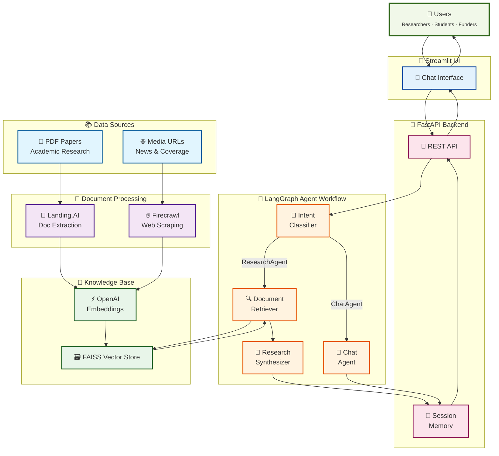

# LabRAG 🧬

**A Lab Research AI Assistant for Papers and Media Coverage**

LabRAG is an intelligent chatbot that helps researchers, students, stakeholders, and general audience to interact with scientific papers and media coverage through natural language.
With just a few clicks and extremely fast setup, build your own research assistant chatbot for your lab!

## Architecture Overview



## Key Features

- **Multi-Source Knowledge**: Ingests both PDF research papers and web media coverage
- **Advanced Document Processing**: Uses [Landing.AI](https://landing.ai/agentic-document-extraction) for intelligent PDF extraction and [Firecrawl](https://www.firecrawl.dev/) for web scraping with advanced extra cleaning step.
- **Agentic Workflow**: Powered by LangGraph with intent classification, document retrieval, and response synthesis
- **Session Memory**: Maintains conversation context across interactions
- **Source Citations**: Always provides references and reasoning for answers
- **Production Ready**: FastAPI backend with Streamlit UI, deployable via Docker

## Key Technologies

### Document Processing
- **[Landing.AI Agentic Document Extraction](https://landing.ai/agentic-document-extraction)**: AI-powered PDF parser that understands complex layouts, tables, and figures. Goes beyond OCR to extract structured data with visual context.
- **[Firecrawl](https://www.firecrawl.dev/)**: Advanced web scraper that converts web pages to clean markdown, handling dynamic content and anti-bot mechanisms.

### AI Framework
- **[LangChain/LangGraph](https://langchain.com/)**: Orchestrates the agentic workflow with intent classification, retrieval, and synthesis
- **[FAISS](https://github.com/facebookresearch/faiss)**: Vector database for similarity search using OpenAI embeddings
- **[OpenAI](https://openai.com/)**: Powers intent classification, chat responses, and research synthesis

### Application Stack
- **[FastAPI](https://fastapi.tiangolo.com/)**: High-performance Python backend with automatic API documentation
- **[Streamlit](https://streamlit.io/)**: Interactive web interface for the chatbot
- **[Docker](https://www.docker.com/)**: Containerized deployment for easy setup and scaling

## Quick Start

### Option 1: Docker (Recommended)

The fastest way to get LabRAG running:

```bash
# 1. Clone the repository
git clone https://github.com/cmcouto-silva/labrag.git
cd labrag

# 2. Set up environment variables
cp .env.example .env
# Edit .env with your API keys (see Required API Keys section)

# IMPORTANT: Knowledge build takes some time to run (requires Firecrawl and LandingAI).
# Since it's still under development, please skip the next steps 3 and 4, and use the prebuilt database instead (testing).

# # 3. Add your research papers
# mkdir -p data/raw/papers
# cp your-papers.pdf data/raw/papers/

# 4. Build the knowledge base (one-time setup) - creates a vector_store under data/ folder 
# docker compose run --rm api python scripts/setup_knowledge_base.py --config configs/default.yml

# 5. Start the services
docker compose up
```

**Access your LabRAG:**
- 🌐 **Streamlit UI**: http://localhost:8501
- 📖 **FastAPI docs**: http://localhost:8000/docs
- 🩺 **Health check**: http://localhost:8000/health

### Option 2: Local Development

For local development and customization, we use [uv](https://github.com/astral-sh/uv), an extremely fast Python package and project manager.  
UV will take care of Python version and all required dependencies for us.

Follow the next steps:

```bash
# 1. Clone and navigate
git clone https://github.com/cmcouto-silva/labrag.git
cd labrag

# 2. Install dependencies with uv (recommended) or pip
uv sync --all-extras
# OR: pip install -e ".[app]"

# 3. Activate virtual environment
source .venv/bin/activate  # On Windows: .venv\Scripts\activate

# 4. Set up environment
cp .env.example .env
# Edit .env with your API keys

# IMPORTANT: Knowledge build takes some time to run (requires Firecrawl and LandingAI).
# Since it's still under development, please skip the next steps 5 and 6, and use the prebuilt database instead (testing).

# # 5. Add your papers
# mkdir -p data/raw/papers
# cp your-papers.pdf data/raw/papers/

# # 6. Build knowledge base
# python scripts/setup_knowledge_base.py --config configs/default.yml

# 7. Run the application

# Terminal 1 - Backend
uvicorn labrag.api.main:app --reload --port 8000

# Terminal 2 - Frontend  
streamlit run labrag/app/main.py --server.port 8501
```

## Required API Keys

LabRAG requires API keys for document processing and AI capabilities:

```bash
# Required - OpenAI for embeddings and chat
OPENAI_API_KEY="sk-..."

# Required - Firecrawl for web scraping
FIRECRAWL_API_KEY="fc-..."

# Required - Landing.AI for PDF processing
VISION_AGENT_API_KEY="..."

# Optional - LangSmith for debugging/tracing
LANGSMITH_TRACING=true
LANGSMITH_API_KEY="..."
LANGSMITH_PROJECT="labrag"
```

**Get your API keys:**
- 🔗 [OpenAI API Key](https://platform.openai.com/api-keys)
- 🔗 [Firecrawl API Key](https://www.firecrawl.dev/)
- 🔗 [Landing.AI Vision Agent Key](https://va.landing.ai/)
- 🔗 [LangSmith](https://smith.langchain.com/)

## 📚 Knowledge Base Setup

LabRAG uses a **two-step process** to build its knowledge base:

### Step 1: Document Ingestion
```bash
python scripts/setup_knowledge_base.py --config configs/default.yml
```

This script:
1. **Processes PDFs** from `data/raw/papers/` using Landing.AI
   - Extracts text, tables, and figures with visual context
   - Maintains page numbers and coordinates for citations
   - Handles complex academic layouts automatically

2. **Scrapes URLs** from your config using Firecrawl
   - Converts web pages to clean markdown
   - Handles dynamic content and anti-bot protection
   - Extracts media coverage and news articles

3. **Creates Vector Embeddings** using OpenAI's text embedding
   - Chunks documents intelligently
   - Stores in FAISS for fast similarity search
   - Preserves metadata for source attribution

Edit `configs/default.yml` to specify your data sources:

```yaml
data_sources:
  papers_dir: "data/raw/papers"
  media_urls:
    - "https://example.com/your-research-coverage"
    - "https://news-site.com/article-about-your-work"

lab_description: |
  Research from Dr. Your Name's lab on [your research area].
  Include key topics, methodologies, and significance.
```

### Step 2: AI Assistant Usage

Once the vector store is built, you're ready  to interact with LabRAG through two modes:

- **Research Mode**: Ask research questions about the lab research and get comprehensive answers with source citations
- **Chat Mode**: Conversational interactions with session memory for follow-up questions and clarifications

All responses include direct citations, media references, and transparent reasoning steps.

## 🎯 Usage Examples

### Research Queries

```text
"What genes are important for human genetic adaptation in the Amazon Rainforest? Please list the methods used to support these findings."

# Follow up question - it will use the session memory (chat history with the past messages)
"What about the Andean Highlands?"

"What is DSL? Which vocabulary should I know to better understand the DSL paper."
```

### Media Analysis  

```text
"How is the research covered in the media?"
"Look for inconsistencies between the media coverage and the paper about genetic adaptation to Chagas disease"
```

## Pre-built Knowledge Base

LabRAG comes with a **sample knowledge base** featuring:

- Research papers on genetic adaptation and disease resistance
- Media coverage from scientific outlets
- Ready-to-use FAISS index with embeddings

This allows you to test LabRAG immediately and understand how it works before adding your own documents.

## Configuration

### Document Processing

```yaml
data_sources:
  papers_dir: "data/raw/papers"
  media_urls:
    - "https://your-media-coverage.com"
```

### Agent Behavior

Customize prompts in `configs/prompts.yml`:

- Intent classification prompt
- Research synthesis templates  
- Chat response styles

## Development

### Project Structure

```bash
labrag/
├── 📁 labrag/                       # Main Python package
│   ├── 🤖 agents/                   # LangGraph agentic workflow
│   │   ├── graph.py                 # Main workflow orchestration
│   │   ├── nodes.py                 # Individual agent nodes (intent, retrieve, respond)
│   │   ├── state.py                 # Shared state management
│   │   └── utils.py                 # Agent utilities
│   ├── 🌐 api/                      # FastAPI backend
│   │   ├── main.py                  # API application entry point
│   │   └── routes/                  # API endpoint definitions
│   │       ├── chat.py              # Chat interaction endpoints
│   │       └── health.py            # Health check endpoints
│   ├── 🎨 app/                      # Streamlit frontend
│   │   └── main.py                  # UI application entry point
│   ├── 📚 ingestion/                # Document processing pipeline
│   │   ├── knowledge_base.py        # Knowledge base builder orchestrator
│   │   ├── loaders/                 # Document loading utilities
│   │   │   ├── document_loader.p    y # Generic document loader interface
│   │   │   └── vector_store.py      # FAISS vector store management
│   │   └── parsers/                 # Document parsing engines
│   │       ├── cache.py             # Caching utilities for parsed content
│   │       ├── models.py            # Data models for parsed documents
│   │       ├── pdf_parser.py        # Landing.AI PDF processing
│   │       └── url_parser.py        # Firecrawl web scraping
│   ├── config.py                    # Settings and configuration management
│   └── utils.py                     # General utilities
├── ⚙️ configs/                      # Configuration files
│   ├── default.yml                  # Main configuration (data sources, settings)
│   └── prompts.yml                  # LLM prompts for different tasks
├── 📊 data/                         # Data storage and examples
│   ├── examples/                    # Sample documents for testing
│   │   └── paper_with_figure_2p.pdf
│   ├── raw/                         # Source documents
│   │   └── papers/                  # PDF research papers
│   │       ├── iptc-24515-ms.pdf 
│   │       ├── msab339.pdf
│   │       ├── s41598-018-31100-6.pdf
│   │       └── sciadv.abo0234.pdf
│   └── vector_store/                # FAISS vector database - created after setting up knowledge base
│       ├── index.faiss              # Vector embeddings index
│       └── index.pkl                # Metadata and document references
├── 🔧 scripts/                      # Utility and setup scripts
│   └── setup_knowledge_base.py      # One-time knowledge base creation
├── 📓 notebooks/                    # Jupyter notebooks for development/demos
│   ├── demo_LandingAI.ipynb         # Landing.AI document parsing demo
│   ├── demo.ipynb                   # General system demonstration
│   └── graph.ipynb                  # LangGraph workflow visualization
├── 📋 tests/                        # Test suite (TODO: implement)
├── 🗂️ artifacts/                    # Generated artifacts and diagrams
│   └── langgraph_diagram.png        # Workflow visualization
├── 📖 docs/                         # Additional documentation
│   └── ROADMAP.md                   # Development ideas/roadmap
├── 🐳 docker-compose.yml            # Container orchestration
├── 🐳 Dockerfile                    # Container image definition
├── 📦 pyproject.toml                # Python project configuration
├── 🔒 uv.lock                       # Dependency lock file
├── ⚡ Makefile                       # Development shortcuts
└── 📜 LICENSE                       # License information
```

**Key Directories Explained:**

🤖 **`labrag/agents/`** - The brain of LabRAG

- Implements agentic workflow using LangGraph
- `graph.py`: Orchestrates the conversation flow (intent → retrieve → respond)
- `nodes.py`: Individual processing steps (classify intent, search documents, synthesize answers)
- `state.py`: Manages conversation context and memory

🌐 **`labrag/api/`** - RESTful backend services  

- FastAPI application with automatic OpenAPI documentation
- Handles chat interactions and system health monitoring
- Designed for easy integration with external applications

📚 **`labrag/ingestion/`** - Document processing pipeline

- `parsers/`: Specialized engines for different document types
  - `pdf_parser.py`: Uses Landing.AI for intelligent PDF extraction
  - `url_parser.py`: Uses Firecrawl for clean web content scraping
- `loaders/`: Manages vector store operations and document loading
- `knowledge_base.py`: Orchestrates the entire ingestion process

📊 **`data/`** - Knowledge repository

- `raw/papers/`: Source PDF documents (research papers)
- `vector_store/`: FAISS database with embeddings and metadata -> created with `setup_knowledge_base.py`
- `examples/`: Sample documents for testing and demonstration

⚙️ **`configs/`** - Configuration management

- `default.yml`: Main settings (data sources, model parameters, system behavior)
- `prompts.yml`: LLM prompts for different tasks (intent classification, synthesis, etc.)

### Running Tests

```bash
# TODO
# uv run pytest tests/
```

### Adding New Features

1. Fork the repository
2. Create a feature branch
3. Add tests for new functionality
4. Submit a pull request

## 📄 License

This project is licensed under the [CC BY-NC 4.0](https://creativecommons.org/licenses/by-nc/4.0/) - see the [LICENSE](LICENSE) file for details.

---

&nbsp;

**Built with ❤️ for the research community!**
